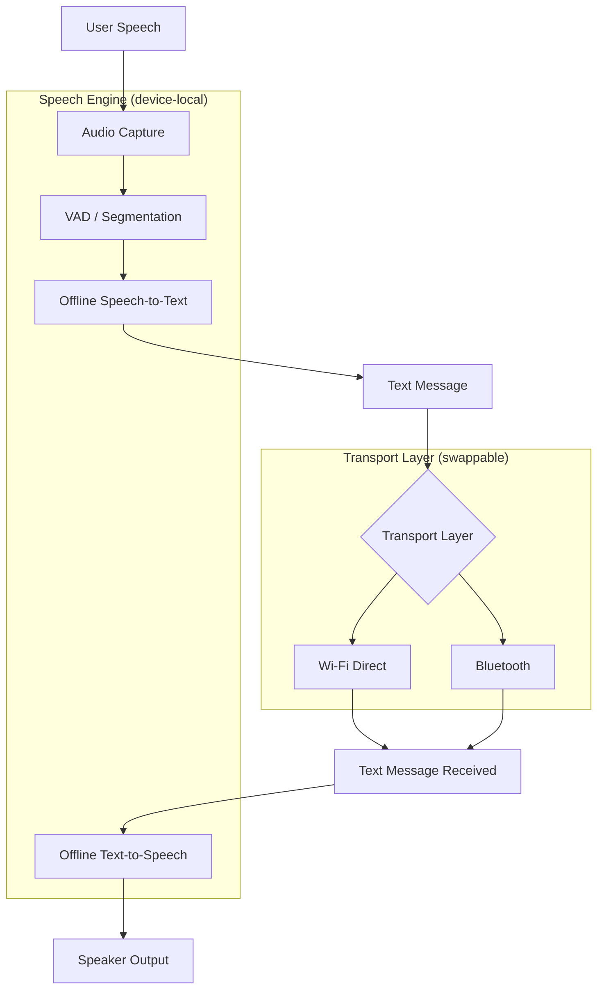

# iTANTRA

Offline, multilingual, device-to-device speech communication for constrained data links.

Smart India Hackathon 2026 · Problem Statement SIH26173 · Organisation: Indian Space Research Organisation (ISRO), Department of Space · Category: Software · Theme: Smart Automation

Status: Early development. No functional implementation exists in this repository yet — see [Current Development Status](#current-development-status).

## Table of Contents

1. [Overview](#overview)
2. [Problem Statement](#problem-statement)
3. [Core Idea](#core-idea)
4. [System Architecture](#system-architecture)
5. [Current Development Status](#current-development-status)
6. [Technology Stack](#technology-stack)
7. [Language Support](#language-support)
8. [Development Environment](#development-environment)
9. [Getting Started](#getting-started)
10. [Repository Structure](#repository-structure)
11. [Two-Phone Communication Concept](#two-phone-communication-concept)
12. [Constrained-Link Evaluation](#constrained-link-evaluation)
13. [Offline-First Design](#offline-first-design)
14. [Security and Privacy](#security-and-privacy)
15. [Benchmarking Plan](#benchmarking-plan)
16. [Roadmap](#roadmap)
17. [Team and Workflow](#team-and-workflow)
18. [Model Files and Large Assets](#model-files-and-large-assets)
19. [Limitations](#limitations)
20. [Documentation](#documentation)

## Overview

iTANTRA is a proposed Android system for speech-based communication over links that cannot reliably carry live audio — degraded or intermittent Wi-Fi Direct/Bluetooth connections, disaster-response scenarios, remote or field deployments, and other low-bandwidth conditions.

Rather than transmitting raw audio, the system is designed to convert speech to text locally, send the compact text between devices, and reconstruct speech locally on the receiving device. This keeps the user experience voice-based while making the data actually crossing the link small.

This repository currently contains project documentation only. Implementation has not started; this README describes the intended system, the team's engineering decisions to date, and current progress.

## Problem Statement

**Official SIH problem statement identity** (Problem Statement ID SIH26173):

| Field | Value |
|---|---|
| PS Number | SIH26173 |
| Title | iTantra – Indian Multilingual TTS & STT Aided Neural Transceiver Radio Access for low bitrate links |
| Organisation | Indian Space Research Organisation (ISRO), Department of Space |
| Category | Software |
| Theme | Smart Automation |

These fields reflect the SIH 2026 problem statement listing as sourced during project research. The full official problem statement text (background, detailed expected outcome, and evaluation criteria as published by SIH/ISRO) should be cross-checked directly against the official SIH portal before being cited in any submission — this repository does not reproduce that text verbatim.

Everything beyond the fields above — target languages, specific performance numbers, architecture choices, model selections, and protocol design — reflects this team's own engineering interpretation and decisions, not literal SIH requirements. These are marked accordingly throughout this document.

## Core Idea

Sending live audio over a constrained link is expensive: even compressed speech requires a continuous, low-jitter stream, and a link that drops for even a fraction of a second produces an audible gap that cannot be recovered.

iTANTRA's proposed approach:

```
Speech (Device A)
   -> Voice Activity Detection / segmentation
   -> Offline Speech-to-Text
   -> Compact text message
   -> Device-to-device transport (Wi-Fi Direct / Bluetooth)
   -> Compact text message received (Device B)
   -> Offline Text-to-Speech
   -> Speech (Device B)
```

A short spoken utterance becomes a small text payload instead of a continuous audio stream. Text is also easier to retransmit losslessly than audio, and tolerates a link that is briefly unavailable in a way a live audio stream cannot.

This trade is not free: the listener hears a synthesized voice reconstructed from recognized text, not the original speaker's waveform. The system is designed around *semantic* transmission (what was said) rather than *acoustic* transmission (how it sounded). This trade-off, and its consequences for accuracy and naturalness, is treated as a core design constraint rather than a hidden limitation.

No compression ratio, latency figure, or accuracy number is claimed here. These will be measured once an implementation exists — see [Benchmarking Plan](#benchmarking-plan).

## System Architecture

The diagram below shows the target architecture. It has not been implemented; it is the design the team is building toward. The speech-processing pipeline (VAD, STT, TTS) and the transport layer are designed to be logically independent, so the transport mechanism can change without changing how speech is processed.



Two operating modes are planned at the transport/UX level:

- **Push-to-talk** — half-duplex, explicit press-to-transmit interaction.
- **Continuous mode** — pause-based segmentation without an explicit transmit action.

Neither mode is implemented yet.

## Current Development Status

| Component | Status |
|---|---|
| Environment setup | In Progress |
| Android application | Planned |
| Audio pipeline | Planned |
| VAD | Planned |
| Offline STT | Under Evaluation |
| Offline TTS | Under Evaluation |
| Device-to-device transport (Wi-Fi Direct) | Planned |
| Device-to-device transport (Bluetooth) | Planned |
| Push-to-talk mode | Planned |
| Continuous mode | Planned |
| Multilingual support | Planned |
| Constrained-link simulator | Planned |
| Benchmarking | Planned |
| Two-device testing | Planned |

"Under Evaluation" means candidate offline STT/TTS runtimes and models are being researched and compared; none has been selected or integrated. Nothing in this table is marked "Implemented" because no functional code currently exists in this repository.

## Technology Stack

### Selected

| Area | Choice |
|---|---|
| Application platform | Android (native) |
| Application language | Kotlin |
| UI framework | Jetpack Compose |
| Version control | Git / GitHub |

These are the team's engineering decisions for the application layer. None has been implemented in this repository yet.

### Technology under evaluation

The following are candidates being researched for the offline speech pipeline. None is committed to the project; none is installed or integrated.

| Candidate | Role | Status |
|---|---|---|
| ONNX Runtime (Mobile) | Neural network inference | Under evaluation |
| sherpa-onnx | Streaming ASR / neural TTS / VAD wrapper | Under evaluation |
| AI4Bharat / Indic ASR models | Indian-language speech recognition | Under evaluation |
| Candidate offline TTS models (Indic-language coverage) | Speech synthesis | Under evaluation |

A key open engineering problem, identified during research rather than assumed: no single permissively licensed, mobile-sized model currently covers all ten target languages for either speech-to-text or text-to-speech. Resolving this (via a routed set of models, phased language rollout, or another approach) is an active decision, not yet finalized.

### Explicitly not yet decided

- Final STT model(s) per language
- Final TTS model(s) per language
- Model file distribution mechanism (see [Model Files and Large Assets](#model-files-and-large-assets))
- Exact Android minSdk / targetSdk / compileSdk (to be set when the Android project is initialized, against current Android Studio defaults at that time)

## Language Support

Target language scope (engineering decision, not verified against literal SIH text):

| Language | Status |
|---|---|
| English | Planned |
| Hindi | Planned |
| Gujarati | Planned |
| Marathi | Planned |
| Kannada | Planned |
| Malayalam | Planned |
| Tamil | Planned |
| Telugu | Planned |
| Odia | Planned |
| Bengali | Planned |

No language has an integrated STT or TTS path yet. This table will be updated per-language as implementation and validation progress, distinguishing Implemented / In Progress / Planned per language rather than treating language support as a single milestone.

## Development Environment

### Required

- Android Studio (current stable channel)
- A JDK version compatible with the Android Studio / Android Gradle Plugin version in use
- Android SDK (Platform, Build-Tools, Platform-Tools) via Android Studio's SDK Manager
- Android Platform Tools / ADB
- Git
- An Android device for real-device testing (microphone, Bluetooth, and Wi-Fi Direct behavior cannot be fully exercised on an emulator)

### Recommended

- Physical Android device with USB debugging enabled
- A Linux, macOS, or Windows development machine capable of running Android Studio
- GitHub CLI (`gh`), for a smoother two-person pull-request workflow

### Phase-specific (not required for initial setup)

- Python 3, for offline model export/inspection/quantization tooling — relevant only once STT/TTS model integration begins
- CMake / Ninja, relevant only once native (C++/JNI) inference code is introduced
- ML inference dependencies (e.g. ONNX Runtime, sherpa-onnx), added as Gradle dependencies at the point STT/TTS integration actually starts

An Android emulator is not treated as a required tool. It can be useful for UI iteration, but cannot exercise microphone input, Bluetooth pairing, or Wi-Fi Direct — these require a physical device regardless.

### Reference development environment

One contributor's current development machine, listed for transparency and reproducibility — this is not a project-wide minimum requirement:

| Item | Value |
|---|---|
| OS | Zorin OS 18.1 (Ubuntu 24.04 base) |
| Architecture | x86_64 |
| JDK | 17 |
| Git | Installed |
| Python | 3 |
| CMake | Installed |
| ADB | Installed |
| Test device | OnePlus Nord CE4, Android 15, 8 GB RAM |

Other contributors are not required to match this configuration; any machine meeting the Required list above is sufficient.

## Getting Started

Project initialization is currently in progress. No Android/Gradle project exists in this repository yet, so there is no build command to run.

The only setup step currently available:

```bash
git clone https://github.com/tanmayjoshi01/iTANTRA.git
```

Once the Android project is initialized, this section will be updated with actual build, run, and test commands corresponding to files present in the repository. Instructions will not be published here ahead of the code they describe.

## Repository Structure

### Current

```
iTANTRA/
└── README.md
```

### Planned

The structure below is a design target for organizing the codebase once implementation begins. It does not exist yet and is included for planning purposes only.

```
iTANTRA/
├── app/                  # Android application module (Kotlin, Jetpack Compose)
├── speech-engine/        # VAD, STT, TTS integration (offline inference)
├── transport/            # Wi-Fi Direct / Bluetooth transport abstraction
├── docs/                 # Architecture, protocol, and model documentation
├── benchmarks/           # Benchmark harnesses and results
└── README.md
```

Actual module boundaries may change once implementation starts.

## Two-Phone Communication Concept

The target demonstration scenario involves two Android devices:

1. Device A captures speech via the microphone.
2. Device A's on-device VAD and STT convert speech to text, without network access.
3. The resulting text message is sent to Device B over a direct device-to-device link (Wi-Fi Direct or Bluetooth) — no internet connection, server, or cloud service is involved.
4. Device B receives the text and synthesizes speech locally via on-device TTS.
5. Device B plays the synthesized speech aloud.

This is designed to work in both directions and under two interaction modes (push-to-talk and continuous), described in [System Architecture](#system-architecture). None of this flow is implemented yet; this section describes the design target.

## Constrained-Link Evaluation

A planned part of the project is a constrained-link simulator that artificially restricts the device-to-device connection to evaluate how the system behaves under adverse conditions. Planned variables include:

- Bandwidth / bitrate ceiling
- End-to-end latency
- Packet loss rate
- Jitter

The goal is to demonstrate that compact text-based communication remains usable under conditions where raw audio transmission would degrade or fail. No simulator exists yet, and no results have been produced. Any performance figures published in this repository in the future will be reported alongside the exact test conditions and methodology used to produce them.

## Offline-First Design

iTANTRA's runtime communication path is designed to require no cloud STT, no cloud TTS, no internet-based APIs, and no external server, once the application and its models are provisioned on-device.

Where this differs from full offline operation:

- Initial installation and model provisioning may require internet access one time, to download the application and language model files.
- Some Android platform APIs (for example, Wi-Fi Direct's use of standard Java sockets) may require the `INTERNET` permission to be declared in the manifest for platform reasons, without the application making any external network calls at runtime. This distinction, if it applies, will be documented explicitly and verified (e.g. by testing in airplane mode).

No claim of complete offline operation is made until it has been verified end-to-end in the running application.

## Security and Privacy

Processing speech on-device, rather than sending it to a cloud speech-recognition or synthesis service, reduces the number of parties that handle a user's spoken audio and reduces dependence on external speech-processing infrastructure.

This is a design property, not an absolute guarantee. It does not by itself make the system fully private or secure — that also depends on decisions not yet finalized, including how device pairing is authenticated and how messages are protected in transit. These will be documented here once implemented and reviewed, rather than assumed.

## Benchmarking Plan

The following metrics are planned. No values are reported yet; all are marked "To be benchmarked" until measured against an actual implementation and a documented test methodology.

**Speech-to-Text**

| Metric | Value |
|---|---|
| Word Error Rate (WER) | To be benchmarked |
| Latency | To be benchmarked |
| Real-time factor | To be benchmarked |
| RAM usage | To be benchmarked |
| CPU usage | To be benchmarked |

**Text-to-Speech**

| Metric | Value |
|---|---|
| Latency | To be benchmarked |
| Real-time factor | To be benchmarked |
| RAM usage | To be benchmarked |
| CPU usage | To be benchmarked |

**Communication**

| Metric | Value |
|---|---|
| Payload size per message | To be benchmarked |
| Transmission latency | To be benchmarked |
| Packet count | To be benchmarked |
| Connection / reconnection time | To be benchmarked |

**End-to-end**

| Metric | Value |
|---|---|
| Speech-to-speech latency | To be benchmarked |

## Roadmap

All phases below are planned; none is complete unless explicitly stated otherwise.

| Phase | Description | Status |
|---|---|---|
| Phase 0 | Foundation (environment, repository, tooling) | In Progress |
| Phase 1 | Audio capture and VAD | Planned |
| Phase 2 | Offline speech-to-text integration | Planned |
| Phase 3 | Offline text-to-speech integration | Planned |
| Phase 4 | Device-to-device communication transport | Planned |
| Phase 5 | First end-to-end MVP (single language, one transport) | Planned |
| Phase 6 | Push-to-talk mode | Planned |
| Phase 7 | Continuous communication mode | Planned |
| Phase 8 | Multilingual expansion | Planned |
| Phase 9 | Bluetooth transport | Planned |
| Phase 10 | Constrained-link evaluation | Planned |
| Phase 11 | Benchmarking and optimization | Planned |
| Phase 12 | Reliability hardening | Planned |
| Phase 13 | Final testing and demonstration | Planned |

## Team and Workflow

**Team**

| Contributor | Primary responsibility |
|---|---|
| Tanmay | Audio pipeline, VAD, offline STT, offline TTS, ML/model work, AI benchmarking |
| Paras | Android application, UI, communication protocol, Wi-Fi Direct, Bluetooth, constrained-link simulator |
| Both | Integration, testing, benchmarking, release |

**Git workflow**

```
main
  -> feature branch
     -> Pull Request
        -> review
           -> merge
              -> main
```

- All changes are made on a feature branch and merged via Pull Request after review.
- Direct pushes to `main` are not part of the intended workflow.
- Branch protection on `main` has not been verified as configured on GitHub at the time of writing; this document does not claim it is enforced.

## Model Files and Large Assets

No model files exist in this repository. When STT/TTS models are integrated, the intended approach is to keep large model binaries out of normal Git version control and provision them through a separate, documented mechanism (for example, versioned external hosting with checksums, rather than committing binaries directly). The exact mechanism has not been finalized and will be documented here once decided.

Where model licenses permit redistribution, license information for each model in use will be recorded alongside it.

## Limitations

The following are known constraints affecting this project, independent of implementation progress:

- Target deployment hardware includes low- and mid-range Android phones with limited CPU and RAM, which constrains model size and inference speed.
- No single permissively licensed, mobile-sized model currently covers all ten target languages for STT or TTS (see [Technology under evaluation](#technology-under-evaluation)).
- Speech recognition accuracy is expected to degrade in noisy environments; this has not yet been characterized.
- Text-to-speech latency and voice naturalness involve a trade-off against model size on constrained hardware.
- Bluetooth and Wi-Fi Direct behavior varies across Android OEMs and Android versions, which may affect device-to-device reliability.
- Battery consumption during continuous listening/inference has not yet been measured.
- Constrained-link behavior (packet loss, jitter, low bitrate) has not yet been evaluated against an actual implementation.

This list will be revised as implementation progresses and constraints are either resolved or newly discovered.

## Documentation

The following documents are planned but do not yet exist. No links are provided until the corresponding document exists in this repository.

| Document | Status |
|---|---|
| Problem Statement reference | Not yet available |
| Architecture documentation | Not yet available |
| Communication protocol specification | Not yet available |
| Model documentation | Not yet available |
| Benchmark results | Not yet available |
| Testing documentation | Not yet available |
| Build instructions | Not yet available |

---

This README reflects the state of the project as of the most recent update and will be revised as implementation progresses. Where a claim cannot be verified against this repository's actual contents, it is marked as planned, under evaluation, or not yet decided rather than stated as fact.
