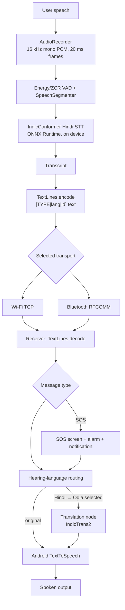
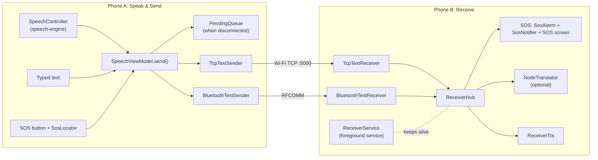
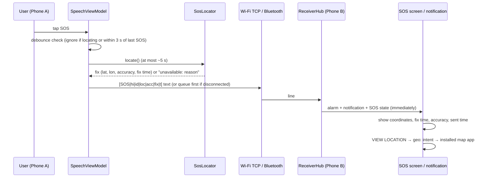
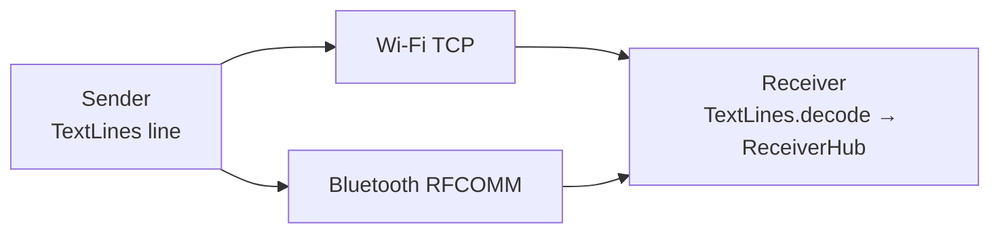

# iTANTRA

**Offline Emergency Voice Communication over Low-Bandwidth and Intermittent Links**

Smart India Hackathon 2026 · Problem Statement **SIH26173** · Indian Space Research Organisation (ISRO), Department of Space · Category: Software · Theme: Smart Automation

iTANTRA is an Android prototype that lets two phones hold a voice-driven conversation without carrying live audio over the link. The sending phone recognises speech **on the device**, sends a few dozen bytes of text over **Wi-Fi TCP or Bluetooth RFCOMM**, and the receiving phone **speaks the message aloud** with text-to-speech. A dedicated **SOS** mode sends an emergency message with the sender's **GPS location** and raises a full-screen alarm on the receiver, including when the receiver's app is not on screen.

```
Speech → on-device speech recognition → compact text message → Wi-Fi TCP / Bluetooth RFCOMM
       → receiver decodes → (translation, where supported) → text-to-speech → spoken output
```

---

## Contents

1. [Overview](#overview)
2. [What the prototype does](#what-the-prototype-does)
3. [Core communication pipeline](#core-communication-pipeline)
4. [System architecture](#system-architecture)
5. [Message protocol: NORMAL, ALERT, SOS](#message-protocol-normal-alert-sos)
6. [GPS-enabled SOS communication](#gps-enabled-sos-communication)
7. [Transport system](#transport-system)
8. [Device discovery](#device-discovery)
9. [Language support and translation](#language-support-and-translation)
10. [Speech pipeline](#speech-pipeline)
11. [Receiver text-to-speech](#receiver-text-to-speech)
12. [Background receiving](#background-receiving)
13. [Reliability and security](#reliability-and-security)
14. [Low-bandwidth design rationale](#low-bandwidth-design-rationale)
15. [User interface](#user-interface)
16. [Validation](#validation)
17. [Project structure](#project-structure)
18. [Technology stack](#technology-stack)
19. [Setup and build](#setup-and-build)
20. [Demo procedure](#demo-procedure)
21. [Known limitations](#known-limitations)
22. [Future work](#future-work)
23. [Why this addresses the problem](#why-this-addresses-the-problem)
24. [Team](#team)
25. [License and third-party components](#license-and-third-party-components)
26. [Further documentation](#further-documentation)

---

## Overview

**Problem.** In disaster response, field operations and remote deployments, the only link between two people may be degraded Wi-Fi, a short-range Bluetooth connection, or another low-bitrate, intermittent channel. Live voice needs a continuous, low-jitter stream. When the link drops for even a moment the audio is lost, and on a narrow link the stream may not fit at all.

**Approach.** iTANTRA transmits *what was said* instead of *how it sounded*:

- **Speech recognition runs on the sending phone.** An AI4Bharat IndicConformer Hindi model runs through ONNX Runtime, with no cloud service.
- **Only text crosses the link.** Each utterance becomes one short UTF-8 line, typically 40–60 bytes for a spoken phrase (see [Low-bandwidth design rationale](#low-bandwidth-design-rationale)).
- **The receiving phone rebuilds speech.** It speaks the text with Android text-to-speech.
- **Two interchangeable transports carry the same message:** a TCP socket over a shared Wi-Fi network, or Bluetooth Classic RFCOMM between paired phones.
- **Emergency features sit on top:** per-message **ALERT** priority, and **SOS** with an attached GPS location snapshot, a loud alarm and a full-screen emergency screen on the receiver.

The trade-off is deliberate: the listener hears a synthesised voice that reads the recognised text, not the original speaker's voice. Recognition errors therefore reach the listener as text errors, not as audio noise.

---

## What the prototype does

| Capability | Implementation |
|---|---|
| On-device Hindi speech-to-text | IndicConformer Hindi (FP32 ONNX, 470 MB) via ONNX Runtime Android 1.22.0 |
| Voice activity detection and segmentation | Energy + zero-crossing-rate VAD, pause-based utterance segmentation |
| Hold-to-talk and hands-free Start/Stop | Press-and-hold button; releasing it recognises the utterance in progress |
| Wi-Fi transport | TCP socket, port 5000, one UTF-8 line per message |
| Bluetooth transport | Bluetooth Classic RFCOMM to an already-paired phone |
| Receiver discovery (Wi-Fi) | Android NSD / DNS-SD service `_itantra._tcp`, so no IP address needs to be typed |
| Message types | NORMAL, ALERT, SOS |
| SOS with GPS | Location snapshot, timestamp and accuracy attached; map intent on the receiver |
| Receiver speech output | Android `TextToSpeech` (Google engine); ALERT and SOS play on the alarm stream at maximum volume |
| Background receiving | Foreground service keeps the receivers running with the UI closed; SOS raises a high-priority, full-screen-capable notification |
| Language tagging | Hindi, Assamese, Odia; typed text is tagged by its script |
| Translation | One direction, Hindi → Odia, via an offline IndicTrans2 node on a laptop reached over a local link |
| Store-and-forward | Messages sent while disconnected are queued (SOS first), persisted, and delivered on the next connection |
| Duplicate protection | Random 8-character message IDs; the receiver drops a repeated ID |

---

## Core communication pipeline


```mermaid
flowchart TD
    A["User speech"] --> B["AudioRecorder<br/>16 kHz mono PCM, 20 ms frames"]
    B --> C["Energy/ZCR VAD + SpeechSegmenter"]
    C --> D["IndicConformer Hindi STT<br/>ONNX Runtime, on device"]
    D --> E["Transcript"]
    E --> F["TextLines.encode<br/>[TYPE|lang|id] text"]
    F --> G{"Selected transport"}
    G --> H["Wi-Fi TCP"]
    G --> I["Bluetooth RFCOMM"]
    H --> J["Receiver: TextLines.decode"]
    I --> J
    J --> K{"Message type"}
    K -->|"SOS"| L["SOS screen + alarm + notification"]
    K --> M["Hearing-language routing"]
    L --> M
    M -->|"Hindi → Odia selected"| N["Translation node<br/>IndicTrans2"]
    M -->|"original"| O["Android TextToSpeech"]
    N --> O
    O --> P["Spoken output"]
```

Typed messages enter the same pipeline at the encoding step.

---

## System architecture

The code is split into two Gradle modules:

- **`speech-engine`** (Android library): audio capture, VAD, segmentation and speech recognition. It knows nothing about transports or UI.
- **`app`** (Android application): UI, transports, message protocol, receiver logic, TTS, SOS, location and translation client.

Both phones run the **same APK**. A phone is the sender or the receiver depending on which tab is used, and the SOS path has been exercised in both directions.


```mermaid
flowchart LR
    subgraph A["Phone A: Speak & Send"]
        A1["SpeechController<br/>(speech-engine)"] --> A2["SpeechViewModel.send()"]
        A3["Typed text"] --> A2
        A4["SOS button + SosLocator"] --> A2
        A2 --> A5["PendingQueue<br/>(when disconnected)"]
        A2 --> A6["TcpTextSender"]
        A2 --> A7["BluetoothTextSender"]
    end
    subgraph B["Phone B: Receive"]
        B1["TcpTextReceiver"] --> B3["ReceiverHub"]
        B2["BluetoothTextReceiver"] --> B3
        B3 --> B4["SOS: SosAlarm + SosNotifier + SOS screen"]
        B3 --> B5["NodeTranslator<br/>(optional)"]
        B3 --> B6["ReceiverTts"]
        B7["ReceiverService<br/>(foreground service)"] -. keeps alive .- B3
    end
    A6 -- "Wi-Fi TCP :5000" --> B1
    A7 -- "RFCOMM" --> B2
```

### Phone A: sender

| Concern | Component | Notes |
|---|---|---|
| Microphone capture | `speech-engine/audio/AudioRecorder` | `AudioRecord`, 16 kHz, mono, 16-bit PCM, 20 ms frames |
| VAD | `speech-engine/vad/EnergyZcrVoiceActivityDetector` | App tuning in `app/speech/SpeechTuning` |
| Segmentation | `speech-engine/segmentation/SpeechSegmenter` | Pause-based; `flush()` on Stop so the last utterance is kept |
| STT | `speech-engine/stt/IndicConformerRecognizer` | Log-mel features → ONNX → greedy CTC decode |
| Orchestration | `app/speech/SpeechController` | Capture thread only segments; recognition runs on a separate single-thread worker; the model preloads on Start |
| Transcript | `SpeechState.transcript` | Session list; each non-blank result is sent automatically |
| Language selection | `SpeechViewModel.selectSourceLanguage` | One STT model loaded at a time; languages without a model are "text only" |
| Message type | `SpeechViewModel.outgoingMode` | NORMAL or ALERT for speech and typed text; SOS has its own button |
| Encoding | `link/TextLines` | One line per message; see [Message protocol](#message-protocol-normal-alert-sos) |
| Transport | `link/TcpTextSender`, `link/BluetoothTextSender` | Chosen by the Wi-Fi / Bluetooth selector |
| SOS + GPS | `SpeechViewModel.sendSos`, `SosLocator` | See [GPS-enabled SOS](#gps-enabled-sos-communication) |

### Communication layer

- **Framing:** one UTF-8 line per message, terminated by `\n`. Embedded newlines are flattened to spaces before sending.
- **Ordering:** each sender writes on a single serial IO dispatcher, so messages leave in the order they were produced. TCP and RFCOMM are both ordered byte streams.
- **Connection handling:**
  - A TCP connect times out after 5 s.
  - A failed send marks the link as failed and reports "Not sent".
  - Reconnecting is a user action (tap the discovered receiver again). There is no automatic reconnect loop.
- **Receivers:** each accepts one connection at a time. When the sender disconnects, the receiver goes back to listening for the next connection.

### Phone B: receiver

`ReceiverHub` owns the receiving side at process level, not screen level, so it survives the Activity being closed. For every new line from either transport it does the following:

1. Decodes the line with `TextLines.decode`. A line that doesn't match the format is treated as plain NORMAL Hindi text, never as an error.
2. Drops a message whose ID has already been seen.
3. Records the arrival time for the timeline.
4. For **SOS**, immediately sets the SOS state, starts the alarm and posts the SOS notification, before any translation or speech.
5. Queues the message on a single worker. The worker translates it if the receiver chose a hearing language the model covers, then speaks the final text in that language's voice. ALERT and SOS are spoken on the alarm stream.

---

## Message protocol: NORMAL, ALERT, SOS

All three types use one line format, carried unchanged over both transports (`link/TextLines.kt`):

```
[TYPE] text                                   # Hindi, no ID (original, still accepted)
[TYPE|lang|id=xxxxxxxx] text                  # language tag + message ID
[SOS|lang|id=xxxxxxxx|loc=LAT,LON|acc=M|fix=MS|t=MS] text   # SOS with location
```

| Field | Meaning |
|---|---|
| `TYPE` | `NORMAL`, `ALERT` or `SOS` |
| `lang` | `hi`, `as` or `or`: the language the text is written in |
| `id` | 8 hexadecimal characters, random per message, used for duplicate removal |
| `loc` | Latitude,longitude in degrees, 6 decimals, always with `.` as the decimal separator |
| `acc` | Horizontal accuracy in metres (optional) |
| `fix` | Time the location fix was taken, epoch ms (optional) |
| `t` | Time the SOS was created on the sender, epoch ms |

Real lines captured from the devices:

```
[NORMAL|hi|id=36411a1d] नमस्ते
[ALERT|hi|id=b3b0f6bc] मद्द चाहिए
[SOS|hi|id=43b98068|loc=16.991253,73.309061|acc=100|fix=1790675407272|t=1790675407320] SOS: तुरंत मदद चाहिए (CPH2613)
```

**Compatibility rules.**

- Header parts the decoder does not recognise are ignored, so a receiver that doesn't know about location still reads an SOS line correctly.
- A malformed or out-of-range location (for example latitude 91, or `NaN`) is dropped rather than guessed; the SOS itself is kept.

| Type | Sender | Receiver behaviour |
|---|---|---|
| **NORMAL** | Default mode | Added to the message timeline and spoken at normal media volume |
| **ALERT** | "🚨 ALERT" message mode (speech or typed) | Red alert card; spoken on the alarm stream at maximum alarm volume with audio focus. The receiver can also force every message to alert behaviour. |
| **SOS** | Dedicated SOS button | Full-screen red SOS screen, looping alarm, high-priority notification and location display; the SOS text is also spoken as an alert. The screen stays until **ACKNOWLEDGE SOS** is tapped. |

---

## GPS-enabled SOS communication

SOS is a **location snapshot attached to an emergency event**, not continuous tracking.


```mermaid
sequenceDiagram
    participant U as User (Phone A)
    participant VM as SpeechViewModel
    participant L as SosLocator
    participant T as Wi-Fi TCP / Bluetooth
    participant R as ReceiverHub (Phone B)
    participant UI as SOS screen / notification
    U->>VM: tap SOS
    VM->>VM: debounce check (ignore if locating or within 3 s of last SOS)
    VM->>L: locate() (at most ~5 s)
    L-->>VM: fix (lat, lon, accuracy, fix time) or "unavailable: reason"
    VM->>T: [SOS|hi|id|loc|acc|fix|t] text (or queue first if disconnected)
    T->>R: line
    R->>UI: alarm + notification + SOS state (immediately)
    UI->>UI: show coordinates, fix time, accuracy, sent time
    UI->>UI: VIEW LOCATION → geo: intent → installed map app
```

### Sender

1. **Permission.** Tapping SOS without location permission first shows Android's permission dialog (`ACCESS_FINE_LOCATION` + `ACCESS_COARSE_LOCATION`). The SOS is sent **whether or not** the user grants it.
2. **Location** (`SosLocator`, framework `LocationManager`, no Google Play Services). It tries, in order:
   1. a cached fix no more than 2 minutes old;
   2. otherwise a current fix from each enabled provider, waiting at most 5 seconds;
   3. otherwise a cached fix up to 30 minutes old, displayed with its own fix time;
   4. otherwise no location, with a reason such as "location permission denied", "location is turned off" or "no location fix within 5 s".

   Coordinates are never invented.
3. **Message.** The text is `SOS: तुरंत मदद चाहिए (<device model>)`: Hindi ("need help immediately"), tagged `hi`, so receivers can translate and speak it. The device model is the sender identifier. The optional `loc`, `acc` and `fix` parts are added, plus `t`.
4. **Transport.** It goes over the selected transport.
   - If that transport is not connected, the SOS is placed **at the front** of the persisted pending queue.
   - On Wi-Fi, the phone also starts connecting to the first discovered receiver while it looks up the location.
5. **Feedback.** The button shows "📍 Getting location…". A status line then reads "✓ SOS SENT · 📍 Location attached (lat, lon)", or "📍 Location unavailable (reason)", or "SOS QUEUED".
6. **Debounce.** Taps are ignored while a location lookup is in progress and for 3 seconds after an SOS is sent, so one press produces one SOS.

### Receiver

- **Immediately:**
  - `SosAlarm` loops the device alarm sound on the alarm stream at maximum volume, with exclusive transient audio focus. If no alarm sound can be played it falls back to a generated emergency tone, and it stops after 60 s.
  - `SosNotifier` posts a high-priority alarm-category notification whose expanded text includes "Location: lat, lon".
  - The SOS screen state is set.
- **SOS screen:**
  - "🚨 SOS / SOS RECEIVED" and the message text;
  - "📍 Location received" with latitude, longitude, "Located at …" and "±N m";
  - "SOS sent at …";
  - **📍 VIEW LOCATION** and **ACKNOWLEDGE SOS**.

  Without coordinates it shows "📍 Location unavailable". The screen stays until acknowledged.
- **VIEW LOCATION:** opens `geo:LAT,LON?q=LAT,LON(SOS)` in whatever map app is installed (no Maps SDK). If no app can handle it, a toast says "No map application available."
- **Message timeline:** SOS entries show the coordinates.
- **Duplicates:** an SOS with an already-seen ID is ignored. A new SOS replaces the one currently on screen, and every SOS stays in the timeline.

---

## Transport system

| Transport | Status | How it connects | Notes |
|---|---|---|---|
| **Wi-Fi TCP** | Implemented | Both phones on the same Wi-Fi network (for example one phone's hotspot). Receiver listens on TCP port 5000; the sender connects to a discovered receiver or a typed IP. | Found through NSD; manual IP is available under *Advanced / Diagnostics* |
| **Bluetooth RFCOMM** | Implemented | Bluetooth Classic, service UUID `7a1c4b9e-2f3d-4e5a-9b6c-1d2e3f4a5b6c`. The sender picks from the list of **already-paired** devices. | Pairing is done once in Android Settings; no scanning permission is used |

Both transports carry **the same application message** (`TextLines`). Everything above them (message types, SOS, pending queue, duplicate filtering, translation, TTS) is shared, and a new transport only has to move lines.


```mermaid
flowchart LR
    S["Sender<br/>TextLines line"] --> W["Wi-Fi TCP"]
    S --> B["Bluetooth RFCOMM"]
    W --> R["Receiver<br/>TextLines.decode → ReceiverHub"]
    B --> R
```

This is not Wi-Fi Direct: the Wi-Fi path needs an ordinary shared network. A phone hotspot works without internet access.

---

## Device discovery

- **Receiver side:** when the Wi-Fi receiver is listening, the phone registers an NSD (DNS-SD/mDNS) service of type `_itantra._tcp` named `iTANTRA <device model>`, for example `iTANTRA SM-T225`. The Receive screen shows "Available to nearby phones as 'iTANTRA SM-T225'".
- **Sender side:** the Speak & Send screen starts browsing automatically. It lists receivers by name, for example "SM-T225, iTANTRA receiver · Wi-Fi", with a **Connect** button.
- **Manual IP:** the user does not type an IP address in the normal flow. Manual IP and port entry remain under *Advanced / Diagnostics* as a fallback.
- **Bluetooth:** uses the paired-device list rather than network discovery.

---

## Language support and translation

| Language | On-device STT | Text transfer | Translation | Receiver TTS |
|---|---|---|---|---|
| Hindi (हिन्दी, `hi`) | Yes: IndicConformer Hindi | Yes | Source language for Hindi → Odia | Yes (`hi-IN`) |
| Assamese (অসমীয়া, `as`) | **No model**: typed text only | Yes | No | Voice reported available on the SM-T225 |
| Odia (ଓଡ଼ିଆ, `or`) | **No model**: typed text only | Yes | Target of Hindi → Odia | Voice reported available on the SM-T225 |

**Transmission language (sender).**

- The selector shows "🎤 Speech" for languages whose STT model is installed and "Text only" for the others; speech input is disabled for "Text only" languages.
- Only one STT model is loaded at a time.
- Recognised speech is tagged with the language of the model that produced it.
- Typed text is tagged **by its script** (Devanagari → `hi`, Bengali–Assamese → `as`, Odia → `or`), so text is never mislabelled by the selector.

**Hearing language (receiver).**

- **Original:** every message is spoken in the language it was sent in.
- **ଓଡ଼ିଆ · translated:** Hindi messages are translated to Odia and spoken with the Odia voice. Other messages play in their original language.
- Only translations the installed model provides are offered.
- The original text is always kept and shown, with the translation underneath.
- If translation fails or the node is unreachable, the card says "Translation unavailable (reason). Original played." The original is then spoken with its **own** language's voice; Hindi text is never read with an Odia voice.

**Where translation runs.** Translation does **not** run on the phone:

- `app/scripts/translation_node.py` runs **IndicTrans2 indic-indic distilled 320M** (`ai4bharat/indictrans2-indic-indic-dist-320M`) on a laptop, loaded once and reused.
- It uses greedy decoding and runs with `HF_HUB_OFFLINE=1`, so it never contacts the internet at run time.
- It offers exactly one direction, `hi → or`.
- The phone's `NodeTranslator` sends one tab-separated request line over TCP (default `127.0.0.1:8765`, reached with `adb reverse`; the address can be changed under *Advanced*) and reads one reply line.
- An on-phone port was assessed and not attempted. The model uses custom architecture code and Python preprocessing (IndicTransToolkit, two SentencePiece models), and the receiver tablet had about 950 MB of free RAM.

---

## Speech pipeline

### Audio capture
`AudioRecorder` wraps Android `AudioRecord`: 16 kHz, mono, 16-bit PCM, delivered in 20 ms frames (320 samples) on a dedicated capture thread. `RECORD_AUDIO` is declared by `speech-engine` and requested at runtime by the app.

### Voice activity detection
`EnergyZcrVoiceActivityDetector` marks a frame as a speech candidate when two conditions hold:
- its RMS energy is at or above 0.02 of full scale;
- its zero-crossing rate is between 0.01 and 0.45.

Hysteresis prevents flicker:
- **Start:** the app requires **8 consecutive candidate frames (160 ms)**. The library default is 2; the app raised it after measuring silence on the SM-T225, where short noise bursts were being recognised as the word "वाद".
- **End:** a 15-frame (300 ms) hangover.

### Segmentation
`SpeechSegmenter` turns VAD states into utterances. It finalises a segment after 600 ms of non-speech, forces a cut at 15 s, and discards segments shorter than 250 ms or with less than 40 ms of confirmed speech. It keeps a 10-frame (200 ms) pre-roll so word onsets are not clipped. `flush()` hands over the utterance in progress when the user releases HOLD TO TALK or taps Stop.

### Speech-to-text
`IndicConformerRecognizer` loads the AI4Bharat IndicConformer Hindi model, exported to **FP32 ONNX** (`indicconformer_hi.onnx`, 470.2 MB), with ONNX Runtime Android 1.22.0. Per utterance it:
- computes 80-bin log-mel features with its own FFT (`MelSpectrogramFeatureExtractor`, using bundled Hann-window and mel-filterbank constants);
- runs the network;
- decodes the output with greedy CTC over a 5,633-token vocabulary (`CtcGreedyDecoder`).

An INT8-quantised export was tested and **does not load** on ONNX Runtime Android (the `ConvInteger` operator is unsupported), so FP32 is used.

The model and `tokens.txt` are **not** in the APK or the repository. They are loaded from the app's external files directory (`/sdcard/Android/data/com.itantra.app/files/`); see [Setup](#setup-and-build).

### Transcript handling
`SpeechController`:
- preloads the model on Start, showing "Loading speech model…";
- recognises one utterance at a time on a worker thread, never in the audio callback;
- appends each result to a session transcript.

`SpeechViewModel` sends every non-blank result immediately with the selected message type and language.

---

## Receiver text-to-speech

`ReceiverTts` uses Android `TextToSpeech`, explicitly bound to **Google's speech engine** (`com.google.android.tts`). The Samsung tablet's default engine has no Hindi voice.

- **Voices.** At start-up it checks which of Hindi, Assamese and Odia the engine can speak, and switches the locale per message.
- **Missing voice.** If a voice is unavailable, the message is not spoken with a different language's voice. The problem is reported on screen, and the Hindi voice data install screen is offered if it is missing.
- **Warm-up.** A silent warm-up utterance at start-up removes the engine's cold-start delay on the first real message.
- **Ordering.** Messages are queued (`QUEUE_ADD`) and spoken in arrival order.
- **NORMAL** plays on the media stream. **ALERT** and **SOS** play on the alarm stream at maximum alarm volume, with transient audio focus.
- **Offline behaviour.** Whether speech works offline depends on the Google engine having the language's voice data installed on the device. The app does not download voices, and offline TTS has not been verified in airplane mode.

---

## Background receiving

- **Keeping the receiver alive.** The receivers live in `ReceiverHub`, owned by the app process. While any receiver is running, `ReceiverService` runs as a **foreground service** of type `connectedDevice`, with an ongoing "iTANTRA receiver is on" notification that has a **Stop receiver** action. Messages and SOS keep arriving after the user leaves the app.
- **SOS in the background:** Android decides how the high-priority notification with a full-screen intent is shown.
  - Screen off: the SOS screen opens and turns the display on. This was tested without a secure lock screen; the activity is also flagged to show over the lock screen.
  - Screen in use: a heads-up notification appears together with the alarm, and tapping it opens the SOS screen.
  - On Android 14+ the user can revoke full-screen notifications; the Receive screen then offers **Allow full-screen SOS alerts**.
- **Permissions:** notification permission (Android 13+) is requested when a receiver is started.
- **Limits:**
  - A **force-stopped** app, or one whose process has been killed, receives nothing. The service is not sticky and does not restart itself.
  - Long Doze periods with the screen off have not been tested.

---

## Reliability and security

**Implemented reliability mechanisms**

| Mechanism | Detail |
|---|---|
| Message IDs + duplicate filtering | Random 8-hex ID per message; the receiver ignores a repeated ID (per transport) |
| Ordering | Serial send dispatcher per transport; receiver speech queue is first-in, first-out |
| Store-and-forward | Messages produced while the selected transport is disconnected are persisted to `pending_messages.txt` and delivered, in order, on the next connection; SOS is placed first |
| Send failure reporting | A failed send is shown as "✗ Not sent"; it is **not** automatically retried |
| UTF-8 end to end | All sockets read and write UTF-8; Devanagari, Bengali–Assamese and Odia text round-trips (unit-tested) |
| Tolerant decoding | Malformed lines become plain NORMAL text; malformed location parts are dropped |
| Location fallback | SOS is always sent, with or without coordinates, and never with invented ones |
| Translation fallback | Node unreachable or failure → original spoken in its own voice, failure shown |
| SOS debounce | One SOS per press (lock while locating, then 3 s) |

**Security.** Messages are sent **in plain text, without encryption or authentication**, on both transports.
- Anyone on the same Wi-Fi network can connect to port 5000 or read the traffic.
- Bluetooth is limited to paired devices but is not encrypted by the app.
- The translation-node protocol is also plain text.

The privacy benefit comes from keeping **speech recognition on the device**: no audio leaves the phone. Link-level protection is future work.

---

## Low-bandwidth design rationale

Instead of

```
microphone audio → network → speaker
```

iTANTRA sends

```
speech → text → one short line → network → text → speech
```

The table below compares sizes by arithmetic; it is not a link measurement. The microphone captures 16 kHz × 16-bit mono PCM, which is **32,000 bytes per second** before any compression. The messages actually sent in device tests were:

| Message (as sent) | Size including newline |
|---|---|
| `[NORMAL\|hi\|id=36411a1d] नमस्ते` (recognised speech) | 43 bytes |
| `[NORMAL] मेरा नाम पारस है` | 52 bytes |
| `[ALERT\|hi\|id=b3b0f6bc] मद्द चाहिए` | 52 bytes |
| SOS with location, accuracy and times | 144 bytes |

A spoken phrase therefore crosses the link as tens of bytes, sent once. Because a message is a complete unit, it can be queued while the link is down and delivered later; that isn't possible for a live audio stream. This makes the design suitable for degraded Wi-Fi, short-range Bluetooth, field and emergency use, and intermittent links. No codec comparison, bandwidth-limited link test or constrained-link simulation has been run.

---

## User interface

A single Jetpack Compose screen, with the content limited to 720 dp wide on tablets:

- **Header:** "iTANTRA / Emergency Voice Communication" with a status pill (Connected, Ready, Listening or Receiver off).
- **Speak & Send tab**
  - Wi-Fi / Bluetooth selector; discovered receivers or paired devices with **Connect**; connection status.
  - A large red **🚨 SOS** button with its send status.
  - **Message mode:** NORMAL / 🚨 ALERT.
  - **Transmission language:** हिन्दी / অসমীয়া / ଓଡ଼ିଆ, marked "🎤 Speech" or "Text only".
  - **HOLD TO TALK**, plus hands-free Start/Stop.
  - Recognised-message card with delivery status: "✓ Sent to …", "⏳ Pending" or "✗ Not sent".
  - Pending and SOS-pending list, type-a-message box and recent messages.
- **Receive tab**
  - Transport selector and receiver status, including the name the phone is advertised as.
  - **Hearing language:** Original / ଓଡ଼ିଆ · translated, with the translation node status.
  - A red alert/SOS card for the latest ALERT or SOS.
  - Incoming-message timeline showing text, "Received in <language>", time, translation and SOS coordinates.
- **SOS screen:** full-screen red emergency view with location, **VIEW LOCATION** and **ACKNOWLEDGE SOS**.
- **Advanced / Diagnostics** (collapsed by default): manual IP, raw link status, model file, recognition timings, TTS latency, voice availability, the "speak every message as an alert" switch and the translation node address.

---

## Validation

### Automated tests (JVM)

Last full run: `./gradlew clean test assemble` **BUILD SUCCESSFUL**. The app has **88** tests and speech-engine **29**, each run in debug and release variants: 234 executions, 0 failures.

| Test suite | Module | Purpose | Tests |
|---|---|---|---|
| `SpeechControllerTest` | app | Capture/recognition threading, model preload, flush on Stop, transcript session, error handling (fake recognizer, real segmenter) | 30 |
| `SpeechTuningSegmentationTest` | app | App VAD/segmenter tuning against recorded false-trigger shapes | 10 |
| `TcpTextLinkTest` | app | Real localhost TCP: ordering, reconnect after a client drops, newline flattening, failures, NORMAL/ALERT/SOS and SOS with location over TCP | 10 |
| `TextLinesTest` | app | Wire-format encode/decode | 9 |
| `LanguageMessageTest` | app | Language/ID metadata, Unicode round-trip, duplicates, pending queue | 8 |
| `TranslationTest` | app | Hindi → Odia routing, unsupported pairs not faked, pass-through, node protocol, client against a real socket, unreachable node | 9 |
| `SosLocationTest` | app | SOS location encoding, German-locale decimals, malformed coordinates, backward compatibility, fix selection, queue persistence | 7 |
| `SosAndLanguageTest` | app | SOS type, malformed lines, script-based language tagging, SOS first in queue | 5 |
| `SpeechSegmenterTest` | speech-engine | Segmentation, pre-roll, max length, flush, minimum-speech filter | 19 |
| `EnergyZcrVoiceActivityDetectorTest` | speech-engine | VAD thresholds and hysteresis | 9 |
| `MelSpectrogramFeatureExtractorTest` | speech-engine | Kotlin log-mel features against reference features from the desktop pipeline | 1 |

Instrumented test sources also exist: `app/src/androidTest` (4 tests) and `speech-engine/src/androidTest` (9 tests). The app's instrumented tests were updated for the current UI and compile, but have **not** been re-run on a device since the latest UI changes.

### Real-device validation

Devices: **Phone A, OnePlus CPH2613** (Android 16) and **Phone B, Samsung Galaxy Tab A7 Lite SM-T225** (Android 14, 2.7 GB RAM).

**STT on device** (recorded runs in `speech-engine/validation-results/device/`; known 18.2 s Hindi clip):

| Device | Model load | Inference | Real-time factor | Peak app memory (PSS) | Transcript |
|---|---|---|---|---|---|
| OnePlus CPH2613 (2026-09-25) | 4.8 s | 6.0 s | 0.33 | ≈1.14 GB | Exact match with reference |
| Samsung SM-T225 (2026-09-26) | 10.6 s | 16.5 s | 0.91 | ≈1.06 GB | Exact match with reference |

The repeated-inference stability test passed on both phones (3 identical runs). **Word error rate for live microphone speech has not been measured**; a 15-sentence protocol exists (`docs/claude/live-stt-accuracy-experiment.md`) but no valid run has been scored.

**End-to-end scenarios observed on the two phones** (device logs, 2026-09-29):

| Scenario | Result |
|---|---|
| OnePlus speech "नमस्ते" → Hindi STT → Wi-Fi TCP → Samsung → Hindi TTS | Pass; model loaded in 3.7 s on the OnePlus |
| Discovery: Samsung advertised as `iTANTRA SM-T225`, OnePlus connected without typing an IP | Pass |
| Hindi text over Bluetooth RFCOMM, OnePlus → Samsung | Pass |
| NORMAL and ALERT messages; ALERT spoken on the alarm stream | Pass on Wi-Fi and Bluetooth |
| Typed Assamese and Odia text tagged `as` / `or` and spoken with their own voices | Pass (no translation involved) |
| TTS start latency, single message, receipt → audio | 336–566 ms (longer when many messages are queued) |
| SOS, receiver app open | Pass (Wi-Fi and Bluetooth) |
| SOS, receiver app in the background | Pass: heads-up notification plus alarm, tap opens the SOS screen |
| SOS, receiver screen off | Pass: the SOS screen opened by itself about 0.4 s after receipt |
| SOS + GPS over Wi-Fi | Pass: 16.991336, 73.309123 (±23 m) shown on the Samsung |
| SOS + GPS over Bluetooth | Pass: fresh fix in 102 ms (±100 m) |
| SOS + GPS in reverse, Samsung → OnePlus over Bluetooth | Pass: 16.991283, 73.309216 (±24 m) with full-screen SOS on the OnePlus |
| SOS with location permission denied | Pass: sent without coordinates ("location permission denied") |
| SOS with location services off | Pass: sent without coordinates ("location is turned off") |
| VIEW LOCATION | Pass: Google Maps opened with a pin labelled "SOS" on the Samsung; the intent also opened on the OnePlus |
| NORMAL and ALERT after SOS | Pass |

**Translation node** (laptop):
- **Offline self-test:** run in a network namespace with no network interfaces, it translated
  - "मेरा नाम पारस है" → "ମୋର ନାମ ହେଉଛି ପାରସ।"
  - "मुझे पानी चाहिए" → "ମୋତେ ପାଣି ଦରକାର।"
  - "यहाँ आग लगी है" → "ଏଠାରେ ନିଆଁ ଲାଗିଛି।"

  After the first request, each took about 0.5 s, with about 1.2 GB peak memory.
- **Reachability:** the Samsung reached the node over `adb reverse` (the node reported ONLINE).
- **Not yet validated:** a complete Hindi → Odia run on the two phones with spoken Odia output.

---

## Project structure

```
iTANTRA/
├── app/                                   Android application (Kotlin, Jetpack Compose)
│   ├── scripts/
│   │   ├── translation_node.py            Offline IndicTrans2 Hindi → Odia node (laptop)
│   │   ├── score_live_stt.py              WER/CER scorer for the live STT experiment
│   │   └── live_stt_sentences_hi.tsv      Reference sentences H01–H15
│   └── src/
│       ├── main/
│       │   ├── AndroidManifest.xml
│       │   ├── kotlin/com/itantra/app/
│       │   │   ├── MainActivity.kt        Compose UI, permissions, SOS screen, map intent
│       │   │   ├── SpeechViewModel.kt     Sender logic: STT → send, SOS + location, pending queue
│       │   │   ├── ReceiverHub.kt         Receiver logic: decode, dedupe, SOS, translation, TTS
│       │   │   ├── ReceiverService.kt     Foreground service; SOS notification
│       │   │   ├── SosAlarm.kt            Looping alarm on the alarm stream
│       │   │   ├── SosLocator.kt          LocationManager-based location snapshot
│       │   │   ├── link/
│       │   │   │   ├── TextLines.kt       Message model and wire format
│       │   │   │   ├── TcpTextSender.kt / TcpTextReceiver.kt
│       │   │   │   ├── BluetoothText.kt   RFCOMM sender and receiver
│       │   │   │   ├── ServiceDiscovery.kt NSD advertiser and browser
│       │   │   │   ├── PendingQueue.kt    Persisted store-and-forward queue
│       │   │   │   ├── ReceiverTts.kt     Android TextToSpeech wrapper
│       │   │   │   ├── Translation.kt     Routing + translation-node client
│       │   │   │   ├── Language.kt        hi / as / or, script detection
│       │   │   │   └── LocalAddresses.kt
│       │   │   ├── speech/                SpeechController, state, VAD tuning, diagnostics
│       │   │   └── ui/Theme.kt
│       │   └── res/values/strings.xml
│       ├── test/                          JVM unit tests (88)
│       └── androidTest/                   Instrumented UI tests
├── speech-engine/                         Android library: audio, VAD, segmentation, STT
│   ├── src/main/kotlin/com/itantra/speechengine/
│   │   ├── audio/                         AudioRecorder, AudioConfig, AudioFrame
│   │   ├── vad/                           EnergyZcrVoiceActivityDetector, VadConfig
│   │   ├── segmentation/                  SpeechSegmenter, SegmenterConfig
│   │   └── stt/                           IndicConformerRecognizer, mel features, CTC decoder
│   ├── src/main/resources/…/stt/          Hann window, mel filterbank, tokens.txt
│   ├── src/test/ · src/androidTest/       JVM and device tests (+ known Hindi clip)
│   ├── scripts/                           Device validation runner, ONNX variant comparison
│   └── validation-results/                Recorded desktop and device measurements
├── docs/claude/                           Engineering notes, decisions, stage records
├── build.gradle.kts · settings.gradle.kts · gradle/
└── README.md
```

---

## Technology stack

| Area | Technology |
|---|---|
| Language / platform | Kotlin 2.4.20, Android (minSdk 24, target/compile SDK 36), Java 17 toolchain |
| Build | Gradle 9.5.1, Android Gradle Plugin 8.13.2 |
| UI | Jetpack Compose (BOM 2026.06.01, Material 3), single Activity |
| Concurrency | kotlinx.coroutines 1.11.0, `StateFlow` |
| Speech recognition | AI4Bharat IndicConformer (Hindi), FP32 ONNX, ONNX Runtime Android 1.22.0 |
| Signal processing | Own log-mel feature extractor and greedy CTC decoder (Kotlin) |
| VAD | Energy + zero-crossing-rate detector (Kotlin) |
| Text-to-speech | Android `TextToSpeech`, Google speech engine |
| Transports | `java.net` TCP sockets; Android Bluetooth Classic RFCOMM |
| Discovery | Android `NsdManager` (DNS-SD / mDNS) |
| Location / maps | Android `LocationManager`; `geo:` intent to the installed map app |
| Background | Foreground service (`connectedDevice`), notification channels, full-screen intent |
| Translation (laptop) | Python 3.12, PyTorch (CPU), Hugging Face Transformers 4.46.3, IndicTransToolkit 1.1.1, SentencePiece; IndicTrans2 indic-indic-dist-320M |
| Testing | JUnit 4.13.2, kotlinx-coroutines-test, AndroidX Test, Compose UI test |

---

## Setup and build

### 1. Prerequisites
- Android Studio or the command-line Android SDK with `platforms;android-36` and matching build-tools, plus JDK 17.
- Two Android phones with USB debugging enabled (Android 7.0 or later; tested on Android 14 and 16).
- Google's speech engine ("Speech Services by Google") on the receiver, with voice data for the languages you want to hear.

### 2. Clone, build and test
```bash
git clone https://github.com/tanmayjoshi01/iTANTRA.git
cd iTANTRA
./gradlew clean test assemble        # JVM tests + debug/release APKs
./gradlew :app:installDebug          # installs on every connected device
```
The debug APK is about 87 MB, mostly ONNX Runtime native libraries for four CPU architectures.

### 3. Provision the Hindi STT model (sending phone)
The 470 MB model is not in the repository. It is an FP32 ONNX export of AI4Bharat's IndicConformer Hindi model, produced outside this repository; see `docs/claude/android-stt-readiness.md` for how it was validated. Launch the app once, then push the model and its token list:
```bash
adb push indicconformer_hi.onnx /sdcard/Android/data/com.itantra.app/files/
adb push tokens.txt             /sdcard/Android/data/com.itantra.app/files/
```
Without the model the app still works for typed messages; the language selector shows "Text only".

### 4. Optional: the Hindi → Odia translation node (laptop)
1. Create a Python environment with `torch` (CPU), `transformers==4.46.3`, `sentencepiece` and `IndicTransToolkit`.
2. The model is gated. Open <https://huggingface.co/ai4bharat/indictrans2-indic-indic-dist-320M>, sign in and accept the terms, then log in locally with your own token:
   ```bash
   huggingface-cli login
   ```
   Never commit or share the token.
3. Download the model once (about 1.3 GB), skipping the duplicate PyTorch weights:
   ```bash
   huggingface-cli download ai4bharat/indictrans2-indic-indic-dist-320M --exclude "pytorch_model.bin"
   ```
4. Check it works offline, then start the node:
   ```bash
   python app/scripts/translation_node.py --selftest
   python app/scripts/translation_node.py --port 8765
   ```
5. Make it reachable from the receiving phone, either:
   - over USB: `adb -s <receiver-serial> reverse tcp:8765 tcp:8765` (the app's default address is `127.0.0.1:8765`); or
   - over Wi-Fi: connect the laptop to the phones' Wi-Fi and enter `<laptop-ip>:8765` under *Receive → Advanced / Diagnostics → Translation node*.

### 5. Prepare the two phones
- **Wi-Fi:** put both phones on the same network. One phone's hotspot works, and internet access is not needed.
- **Bluetooth:** pair the two phones once in Android Settings.
- **SOS location:** turn on the sender's location services.
- **Receiver:** allow notifications when asked. Full-screen SOS alerts must be allowed; this was already allowed on the test tablet, and the app offers a settings shortcut if not.

---

## Demo procedure

### Voice message (Wi-Fi)
1. **Phone B:** Receive → Wi-Fi → **Start receiver**. It shows "Available to nearby phones as 'iTANTRA …'".
2. **Phone A:** Speak & Send → Wi-Fi → tap **Connect** on the discovered receiver.
3. **Phone A:** Message mode **NORMAL**, transmission language **हिन्दी 🎤**.
4. **Phone A:** hold **HOLD TO TALK**, speak a Hindi sentence, and release.
5. Check Phone A's recognised-message card reads "✓ Sent to …".
6. Check Phone B shows the message in the timeline and speaks it.

### Voice message (Bluetooth)
Same steps, with **Bluetooth** selected on both phones. Phone A connects to Phone B from the paired-device list.

### ALERT
On Phone A select **🚨 ALERT** and speak or type a message. Phone B shows the red alert card and speaks the message loudly on the alarm stream.

### Hindi → Odia (with the translation node running)
1. Phone B: Receive → Hearing language **ଓଡ଼ିଆ · translated**; the status reads "Translation ready".
2. Phone A: send Hindi speech or text.
3. Phone B shows the Hindi original, "→ ଓଡ଼ିଆ" and the Odia translation, and speaks the Odia text.

### SOS with location
1. Phone B: start the receiver (Wi-Fi or Bluetooth). Leaving the app or turning the screen off is fine.
2. Phone A: location services on, then tap **🚨 SOS**. Allow location the first time.
3. Phone A shows "📍 Getting location…", then "✓ SOS SENT · 📍 Location attached".
4. Phone B sounds the alarm and shows the full-screen **SOS RECEIVED** screen with latitude, longitude, fix time and accuracy.
5. Tap **📍 VIEW LOCATION** on Phone B. The map app opens at the SOS position.
6. Tap **ACKNOWLEDGE SOS** to silence the alarm and dismiss the SOS screen.

---

## Known limitations

- **Languages.**
  - Speech recognition exists only for Hindi; Assamese and Odia are text-only on the sender.
  - Translation covers one direction (Hindi → Odia) and runs on a laptop, not on the phone.
  - TTS voices depend on what the device's Google engine has installed.
- **Accuracy.** Live-microphone word error rate has not been measured, and recognition in noise has not been characterised. The VAD is a simple energy/ZCR detector with thresholds tuned on one device.
- **Resources.**
  - The STT model needs about 1 GB of app memory.
  - In the app, loading took 3.7 s on the OnePlus and 9.9–12.9 s on the Samsung tablet.
  - The APK is about 87 MB.
  - The model is copied onto the phone with `adb push`; there is no in-app delivery.
- **Links.**
  - Wi-Fi requires a shared network (not Wi-Fi Direct); Bluetooth requires prior pairing.
  - Range is that of ordinary Wi-Fi and Bluetooth Classic.
  - There is no automatic reconnect: after a link failure the user reconnects, and queued messages then flush.
- **Background receiving.**
  - Receiving depends on the foreground service. A force-stopped or killed app receives nothing.
  - Behaviour under long Doze periods was not tested.
  - How the full-screen SOS is presented is decided by Android.
- **GPS.** Indoor fixes so far came from network location (±23–100 m); a satellite fix indoors was not tested. Without any fix, the SOS is sent without coordinates.
- **SOS display.** The receiver shows one SOS at a time, and a newer SOS replaces the one on screen. All are kept in the timeline.
- **Security.** Messages are neither encrypted nor authenticated; see [Reliability and security](#reliability-and-security).

---

## Future work

- STT models for Assamese, Odia and further Indian languages.
- On-device translation, or more translation directions.
- Encrypted, authenticated links between paired phones.
- Automatic reconnection and delivery acknowledgements.
- Additional transports (for example Wi-Fi Direct, mesh, or LoRa/radio modules) carrying the same message format.
- Measured word error rate, and tests over constrained, lossy links.

---

## Why this addresses the problem

- **Voice-driven communication without streaming voice.** Users speak and listen, while the link carries tens of bytes per phrase.
- **Local speech processing.** Recognition runs on the phone and speech is rebuilt on the receiving phone, with no cloud speech service.
- **Two independent transports.** Wi-Fi TCP and Bluetooth RFCOMM carry the same messages, so either can be used when the other is unavailable.
- **Built for interruptions.** Messages are complete units that can be queued and delivered after a link drop, with duplicate protection.
- **Emergency handling.** ALERT priority plus a GPS-enabled SOS that sounds an alarm and presents the sender's location, including when the receiving app is in the background.
- **Honest multilingual behaviour.** Text is tagged by language, and the receiver never presents a translation that did not happen.

---

## Team

| Contributor | Responsibility |
|---|---|
| Tanmay | `speech-engine`: audio capture, VAD, segmentation, IndicConformer STT integration and on-device validation |
| Paras | `app`: Android UI, Wi-Fi and Bluetooth transports, message protocol, discovery, receiver TTS, ALERT/SOS, GPS location, translation integration |

Work happens on feature branches and is merged into `main` through pull requests.

---

## License and third-party components

This repository does **not** currently contain a license file for iTANTRA's own code.

| Component | Use | License |
|---|---|---|
| ONNX Runtime Android 1.22.0 | STT inference | MIT |
| AndroidX / Jetpack Compose | UI and Android libraries | Apache 2.0 |
| kotlinx.coroutines | Concurrency | Apache 2.0 |
| JUnit 4.13.2 | Tests | Eclipse Public License 1.0 |
| AI4Bharat IndicConformer (Hindi) | STT model (not redistributed here) | **Not recorded in this repository:** check the upstream model card before any redistribution |
| AI4Bharat IndicTrans2 indic-indic-dist-320M | Translation model (laptop, downloaded by the user) | MIT (per its Hugging Face listing); access is gated behind accepting its terms |
| PyTorch, Transformers, IndicTransToolkit, SentencePiece | Translation node | See each upstream project |
| Google speech engine | TTS on the receiving device | Part of the device's installed software; not bundled |

---

## Further documentation

- `docs/claude/`: engineering records, including architecture notes, the decision log, stage history, testing and validation levels, Android STT readiness and the live-STT accuracy procedure. Some of these files record earlier stages and are not updated for every feature; **where they differ from this README or the code, the code is authoritative.**
- `speech-engine/validation-results/`: raw desktop and on-device STT measurements.
- `CLAUDE.md`: working rules for AI-assisted development sessions on this repository.

The official SIH26173 problem statement text is not reproduced here. Language scope, architecture and protocol are this team's engineering decisions.
